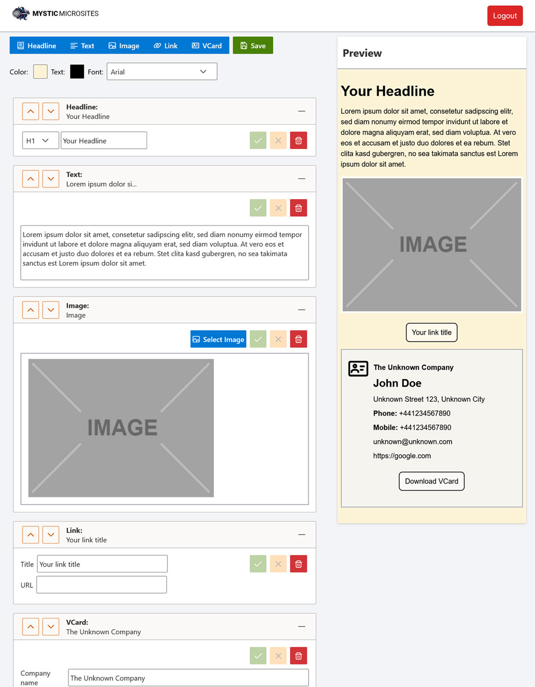

# Mystic Micro Sites

Mystic Micro Sites is a secure and efficient platform for creating mini-websites that are stored encrypted on the server. Access is granted through a unique URL containing a randomly generated password, ensuring that only users with the correct link can access the content. This project includes a frontend built with Angular and a backend implemented in PHP 8.3.



## Features

- **Advanced Encryption**: Utilizes a combination of public/private key encryption, symmetric encryption, and Argon2ID hashing for secure data management.
- **JWT Authentication**: Employs JSON Web Tokens for secure API interactions.
- **Rate Limiting and CSRF Protection**: Implements safeguards against misuse and attacks.
- **Automatic Password Management**: Generates and embeds unique passwords in URLs for secure site access.
- **Master Password Recovery**: Allows site recovery using a master password stored on the server.
- **NFC Tag Integration**: Enables NFC tags to link physical objects to digital content, providing an interactive way to access site details.
- **Modular Codebase**: Designed for easy extension and customization, making it suitable for various development needs.
- **Custom Template Engine**: Small high functional Template Engine for dynamic contet rendering, build from scratch.

## Installation

### Prerequisites

- Node.js (for frontend operations)
- PHP 8.3+
- Composer (for managing PHP dependencies)
- Web server (e.g., Apache, Nginx)

### Setup Process

1. **Clone the Repository**

   ```bash
   git clone https://github.com/yourusername/mystic-micro-sites.git
   cd mystic-micro-sites
   ```

2. **Install PHP Dependencies**

   Navigate to the `backend` directory and run Composer:

   ```bash
   cd backend
   composer install
   ```

3. **Environment Setup**

   The environment variables are automatically configured. The `install-cli.php` script generates necessary encryption keys and configuration files. Run:

   ```bash
   php install-cli.php
   ```

4. **Build the Frontend**

   Go to the `frontend` directory and build the Angular application:

   ```bash
   cd ../frontend
   npm install
   npm run build
   ```

5. **Web Server Configuration**

   Configure your web server to serve the content from the `dist/dashboard` directory and route API requests to the backend PHP services.

## Usage

1. **Access the Editor**

   Use your browser to navigate to the editor interface, where you can create a personalized mini-site using the provided tools.

2. **Site Generation**

   Upon saving your site, you will receive a unique URL with an embedded password, which is required for accessing the site.

3. **Site Access**

   The URL grants access to the site. If lost, you will need to recreate the site or use the master password to generate a new link.

## Configuration Details

### Angular Configuration

- **frontend/src/Configs/**: There are some configs for the frontend like the API Url and more. Take a look into the structure.

- **Build Commands**:
  - **Development**: Run `ng serve` for a local development server.
  - **Production**: Execute `npm run build` for optimized deployment.

### Backend Configuration

- **PHP Environment Variables**: Automatically set up by the `install-cli.php` script. The `.env` file is managed and updated during installation.
- **API Security**: JWT tokens ensure secure session handling, and CSRF tokens protect against request forgery.

### Security Features

- **Encryption Mechanisms**: Combines symmetric and asymmetric encryption to protect user data.
- **Rate Limiting**: Basic rate limiting is implemented to prevent request abuse.

## Use Cases

- **Personal Memorabilia**: Link digital memories to physical objects using NFC tags for easy retrieval and sharing.
- **Educational Content**: Securely share course materials and resources.
- **Private Collections**: Manage and display collections with controlled access.

## Future Enhancements

- **Performance Optimization**: Explore ways to improve load times and encryption efficiency.
- **UI Improvements**: Enhance user interface for greater usability and accessibility.
- **Extended Plugin System**: Develop a plugin system for additional features and integrations.
- **Testing and CI/CD**: Integrate continuous testing and deployment workflows for automated quality assurance.
- **Advanced Analytics**: Implement analytics to track user interactions and improve user engagement.
- **Time Limit**: Time limited access for microsites.
- **Obfuscation**: Obfuscation the main URL, so it's not accessible by reload.
- 
## Contribution

Contributions are encouraged! Please fork the repository and submit a pull request with your improvements.

## License

This project is licensed under the MIT License. See the [LICENSE](LICENSE) file for more information.
